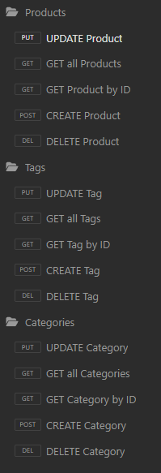

# E-Commerce-BackEnd

 ## Table of Contents
  - [Description](#description)
  - [Installation](#installation)
  - [Usage](#usage)
  - [License](#license)
  - [Contributing](#contributing)
  - [Tests](#tests)
  - [Questions](#questions)

  ## Description
  When creating this project, I set out to set to create the back end for an e-commerce website, so that they can compete with other companies. By completing this assignment, I learned how to properly use Insomnia, as well as gained a greater understanding of Sequelize.

 ## Installation
  Clone this repository into your local machine,  open up the intregrated terminal by right clicking on the "db" folder, then do the following command:

  ```mysql -u root -p```

  After you type in your password, you will want to source your file using the command:

  ```source schema.sql```


  Finally, you will want to right click on server.js and open a new integrated terminal. From here, use the following commands to populate the database, and set up your node modules:

  ```npm run seed```

  ```npm i```
  
  ## Usage
  To use this project, use your server.js integrated terminal, and type in the following command:
  
  ```npm start```

 After that, open up your local Insomnia program, and run whichever commands you like!

 Click [This Link](https://drive.google.com/file/d/1i_fE1B7AyXVFR5yTOCs2rS2VH818Lwc-/view) to watch a helpful demonstration video! Alternatively, you can find the video in the assets folder.
  
 ## License
 
  This project is licensed under the terms of the **[MIT License](https://opensource.org/licenses/MIT)**
  
  ## Contribution
  
Rutgers Fullstack Coding Bootcamp provided the starter code.

  ## Tests
  
Here are the tests that I ran in Insomnia:



When not refering to an id, I added the URL http://localhost:3001/api/[products, categories, tags] (only using the relevant api)

When referring to an id, I used the similar URL of http://localhost:3001/api/[products, categories, tags]/1 

  ## Questions
  If you have any questions or suggestions about this project, please feel free to contact me:
- GitHub: [@jeslocascio](http://github.com/jeslocascio)
- Email: locascioje@gmail.com
